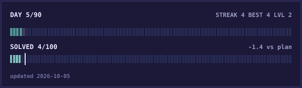

<div align="center">

# 90 Days Challenge

**One problem. One lesson. Every day.**



[**Live tracker**](https://shubhamcodess.github.io/90-days-challenge/) · [Demo view](https://shubhamcodess.github.io/90-days-challenge/?demo)

</div>

A quiet, game-like accountability loop for a 90-day interview-prep push (Oct 1 to Dec 29, 2026).
Claude keeps the score, nudges me on Slack at sensible times, and a calm pixel page shows how it is going.
The bar above rebuilds itself whenever progress changes: each little block on the top row is a day, the lower row is the 100-problem goal.

## The daily loop

| Quest | Counts when |
|---|---|
| **Solve** | at least one problem lands in `lets-dsa` |
| **Learn** | a research or study session is logged with `/learn` |
| **Read** | I react 👀 on the morning digest message |

Solve + Learn keeps the streak. Adding the read makes it a better day. Two solves and a read makes it the best kind.
The goal: **100 problems by Dec 31**, about 1.1 a day.

## How it works

```
lets-dsa · career-os · everything-tech ──┐
/learn entries · Slack replies ──────────┤──► ledger ──► score ──► Slack nudges
                                         │                    └──► docs/ (the page + the bar above)
```

- **Ledger:** an append-only log in `data/ledger/`. Everything else is derived from it.
- **Brain:** `scripts/tick.py` decides what to say, when, and when to stay silent. The scheduled Claude routines only relay its text, so even a small model runs it reliably.
- **Nudges:** a few check-ins a day shaped around my schedule, quiet when nothing is left to do. A picture of the page is added on milestones and in the Sunday review.
- **Saves itself:** routines push a branch, and a GitHub Action opens the PR and merges it.

## Talking to it (Slack replies)

`late` · `off` · `freeze` · `read` · `linkedin: note` · `naukri: note` · `resume: note` · `jobs: note` · `exp: note` · `learn: topic | tag | takeaway`

## Poke around

```sh
sh scripts/run.sh                      # refresh everything
python3 scripts/log_event.py learn --topic "..." --tag dsa --takeaway "..."
python3 -m http.server --directory docs    # preview the page (add ?demo for sample data)
```

## Make it yours

Everything tunable is config: `config/` for pillars, day types, badges and holidays, `docs/config.json` for the page's colours.
Drop a plain-English rule in `inbox.md` and the weekly review picks it up. See `CLAUDE.md` for the ground rules.
